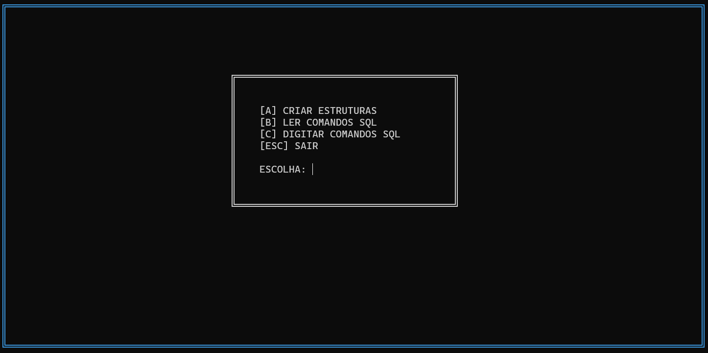
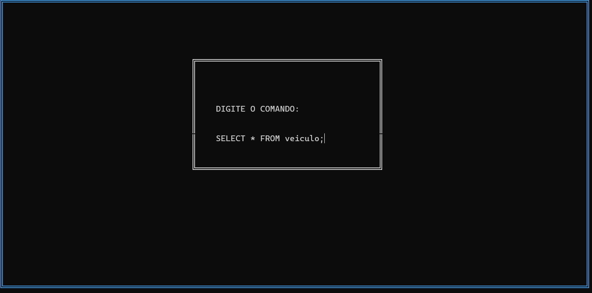
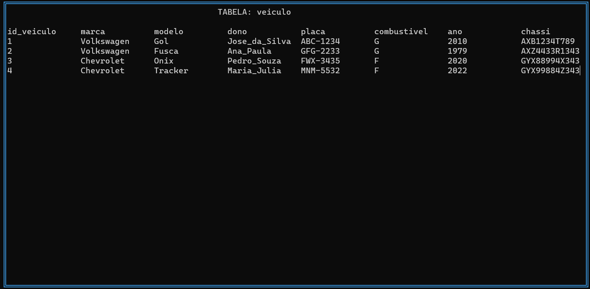

# Simulador de Sistema Gerenciador de Banco de Dados

## Descrição do Projeto

Seu trabalho é implementar um simulador de Sistema Gerenciador de Banco de Dados, contemplando os seguintes comandos de DDL (CREATE TABLE e ALTER TABLE – apenas para adicionar a constraint de chave estrangeira), comandos SQL, mais especificamente de DML (INSERT, UPDATE, DELETE) e de DQL (SELECT). O banco de dados não será constituído por tabelas em arquivos binários, índices de Árvore B+, Hashing entre outras estruturas de dados mais complexas..., e sim formado por listas encadeadas dinâmicas, conforme o desenho das estruturas dinâmicas mostrado nas páginas 1, 2 e 3.

Seu programa deve permitir ao usuário realizar algumas tarefas:

a) Abrir um arquivo contendo o script de criação do banco de dados (exemplo mostrado na página 4, Figura 2);

b) Construir o "banco de dados", a partir do arquivo de script, que na verdade é a criação de todas as listas dinâmicas adequadas para o modelo de dados (tabelas, campos e relacionamentos). Nesse caso são utilizados os comandos de DDL;

c) Permitir ao usuário executar os comandos de DML e DQL. No caso do comando SELECT, deve-se mostrar na tela do computador o resultado no formato de uma tabela.

## MENU DO PROJETO

## COMANDO FEITO PELO USUÁRIO

## VALORES DE UMA TABELA DO BANCO 

